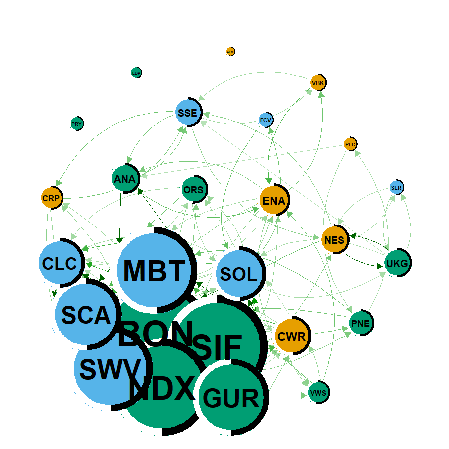

<!-- README.md is generated from README.Rmd. Please edit that file -->

## About the Method

The methodology implemented in this package is developed in the
following research paper, currently submitted:

> **Ferrer, R., Shahzad, S. J. H., Furió, D., & Benammar, R. (2025).**  
> *Systemic Risk in the Tails: Contemporaneous Transmission and
> Spillover Dynamics in European Renewable Energy Equities.*  
> Submitted for publication.

The package implements the quantile-based R² connectedness framework
introduced in the above paper.  
When citing results derived using this code, please cite the paper once
published and this R package.

# QuantileConnectedness

**QuantileConnectedness** provides tools to compute, decompose, and
visualize R² decomposed connectedness measures based on **quantile
correlation coefficients** (Choi & Shin, 2022), extending the approaches
of Hoang & Baur (2022) and Balli et al. (2023).

The package includes:

- `Qcor()` – quantile correlation matrices  
- `R2ConnectednessQ()` – R² decomposed connectedness (full sample or
  rolling)  
- `net_plot()` – network visualization (PMFG or thresholded)  
- `renewable_residuals` – daily residuals for 26 European
  renewable-energy firms (2017–2025)

## Installation

``` r
# install.packages("devtools")
devtools::install_github("yourusername/QuantileConnectedness")
library(QuantileConnectedness)   # <- replace with your package name if different
```

------------------------------------------------------------------------

### Full-sample R² connectedness (q = 0.05, nlag = 1)

``` r
library(ConnectednessApproach)
#> Warning: package 'ConnectednessApproach' was built under R version 4.4.3
#> 
#> Please cite as:
#>  Gabauer, David (2022). ConnectednessApproach.
#>  R package version 1.0.0. https://CRAN.R-project.org/package=ConnectednessApproach
R2conL <- R2ConnectednessQ(
  renewable_residuals,
  window.size = NULL,    
  nlag = 1,
  quantile = TRUE,
  q = 0.05,
  method = "pearson",
  shrink = TRUE,
  progbar = FALSE
)
```

### Figure 1. Lower-tail R2 decomposed connectedness networks among European enewable energy firms

We first need to set the node labels and group firms into their sectors.

``` r
Cnames <- colnames(renewable_residuals)
groups <- list(Renewable = 1:7,
               Solar = 8:15,
               Wind = 16:26)
```

#### Network plot - Overall connectedness

``` r
go <- net_plot(
  R2conL$TABLE$Overall, Cnames,
  layout = "spring",
  groups = groups, div = 5,
  node.size = 35, edge = 3,
  pie.colour = c("black","white")
)
```


#### Network plot - Contemporaneous connectedness

``` r
gc <- net_plot(
  R2conL$TABLE$Contemporaneous, Cnames,
  layout = "spring",
  groups = groups, div = 5,
  node.size = 35, edge = 3,
  pie.colour = c("black","white")
)
```



#### Network plot - Lag connectedness

``` r
gl <- net_plot(
  R2conL$TABLE$Lagged, Cnames,
  layout = "spring",
  groups = groups, div = 8,
  node.size = 35, edge = 2,
  pie.colour = c("black","white")
)
```


------------------------------------------------------------------------

## Figure 2. Time-varying lower tail total connectedness index among European renewable energy companies

For dynamics we use a 200-day window on the 5-firm subset (fast enough
to render).

``` r
dca <- R2ConnectednessQ(
  renewable_residuals[,1:5],
  window.size = 200,
  nlag = 1,
  quantile = TRUE,
  q = 0.05,
  method = "pearson",
  shrink = TRUE,
  progbar = FALSE
)
TCI <- dca$TCI
head(TCI)
#>             Overall Contemporaneous   Lagged
#> 2017-10-13 15.94088        11.87311 4.067770
#> 2017-10-16 15.65963        11.69132 3.968305
#> 2017-10-17 15.65698        11.68220 3.974778
#> 2017-10-18 15.96980        11.68576 4.284041
#> 2017-10-19 14.53213        11.14634 3.385783
#> 2017-10-20 16.28941        11.64794 4.641471
```

``` r
df <- cbind.data.frame(as.Date(rownames(TCI)), TCI[, 1:3, drop = FALSE])
colnames(df) <- c("date", "SOI", "SOIC", "SOIL")
```

``` r
library(ggplot2)

ymin <- 0; ymax <- 40

mytheme <- theme(
  panel.background = element_rect(fill = "transparent"),
  panel.border     = element_rect(fill = "transparent", color = "black", linewidth = 0.6),
  text             = element_text(size = 13, color = "black"),
  axis.text.x      = element_text(color = "black"),
  axis.text.y      = element_text(color = "black"),
  panel.grid.major = element_line(size = 0.1, colour = "grey75"),
  panel.grid.minor = element_line(size = 0.05, colour = "grey85"),
  legend.position  = "bottom",
  legend.title     = element_blank()
)

g_tci <- ggplot(df, aes(x = date)) +
  geom_line(aes(y = SOI),  color = "blue",  linewidth = 0.9) +
  geom_line(aes(y = SOIC), color = "green", linewidth = 0.9) +
  geom_line(aes(y = SOIL), color = "red",   linewidth = 0.9) +
  theme_minimal() +
  coord_cartesian(ylim = c(ymin, ymax)) +
  labs(y = "Connectedness", x = "Date") +
  scale_x_date(date_breaks = "1 year", date_labels = "%Y") +
  geom_vline(xintercept = as.Date("2020-03-01"), linetype = "dashed") +
  geom_vline(xintercept = as.Date("2021-01-01"), linetype = "dashed") +
  geom_vline(xintercept = as.Date("2022-02-24"), linetype = "dashed") +
  annotate("text", x = as.Date("2019-06-01"), y = ymax - 2,
           label = "COVID-19", size = 3.6, hjust = 0) +
  annotate("text", x = as.Date("2021-01-30"), y = ymin + 5,
           label = "Russia–Ukraine war", size = 3.6, hjust = 0) +
  mytheme

g_tci
```


------------------------------------------------------------------------

## References

- Balli, F., Balli, H. O., Louis, R. J., & Pappas, V. (2023). *Dynamic
  Connectedness Across Markets: Revisiting the R² Approach.* Finance
  Research Letters, 56, 104263.  
- Choi, S., & Shin, S. (2022). *Quantile Correlation: Measuring
  Dependence at Different Quantiles.* Journal of Econometrics, 226(1),
  1–24.
- Ferrer, R., Shahzad, S. J. H., Furió, D., & Benammar, R. (2025).
  *Systemic Risk in the Tails: Contemporaneous Transmission and
  Spillover Dynamics in European Renewable Energy Equities.* Submitted
  for publication.
- Hoang, T. H. V., & Baur, D. G. (2022). *R² Connectedness: Measuring
  Integration and Contagion in Financial Markets.* Journal of Financial
  Econometrics, 20(3), 520–544.
